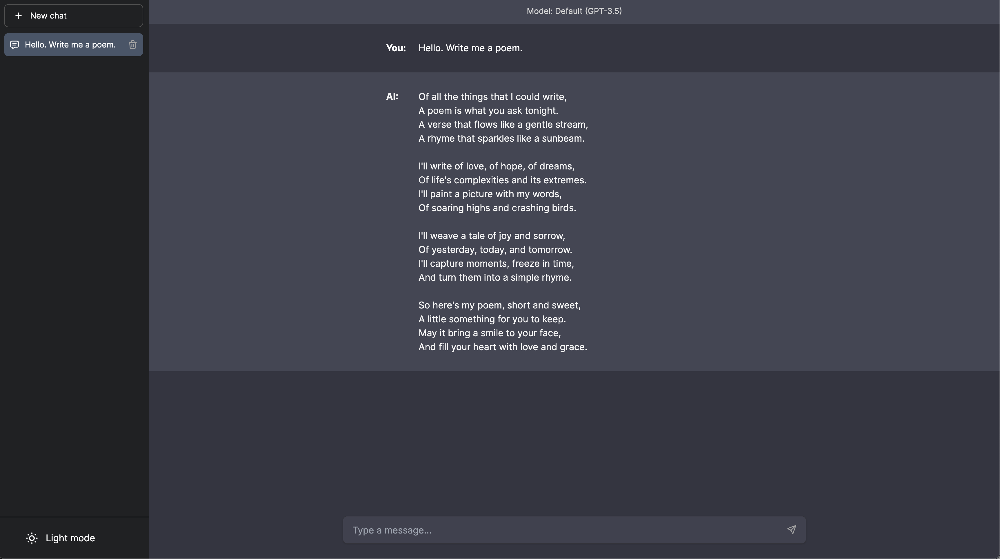

# Chatbot UI

Chatbot UI is an advanced chatbot kit for OpenAI's chat models 




**Docker**

Build locally:

```shell
docker build -t chatgpt-ui .
docker run -e OPENAI_API_KEY=xxxxxxxx -p 3000:3000 chatgpt-ui
```


## Running Locally

**1. Clone Repo**

```bash
git clone https://github.com/shrijan111/chatbot-ui.git
```

**2. Install Dependencies**

```bash
npm i
```

**3. Provide OpenAI API Key**

Create a .env.local file in the root of the repo with your OpenAI API Key:

```bash
OPENAI_API_KEY=YOUR_KEY
```

> You can set `OPENAI_API_HOST` where access to the official OpenAI host is restricted or unavailable, allowing users to configure an alternative host for their specific needs.

> Additionally, if you have multiple OpenAI Organizations, you can set `OPENAI_ORGANIZATION` to specify one.

**4. Run App**

```bash
npm run dev
```

**5. Use It**

You should be able to start chatting.

## Configuration

When deploying the application, the following environment variables can be set:

| Environment Variable  | Default value                  | Description                                             |
| --------------------- | ------------------------------ | ------------------------------------------------------- |
| OPENAI_API_KEY        |                                | The default API key used for authentication with OpenAI |
| DEFAULT_MODEL         | `gpt-3.5-turbo`                | The default model to use on new conversations           |
| DEFAULT_SYSTEM_PROMPT | [see here](utils/app/const.ts) | The defaut system prompt to use on new conversations    |

If you do not provide an OpenAI API key with `OPENAI_API_KEY`, users will have to provide their own key.
If you don't have an OpenAI API key, you can get one [here](https://platform.openai.com/account/api-keys).
